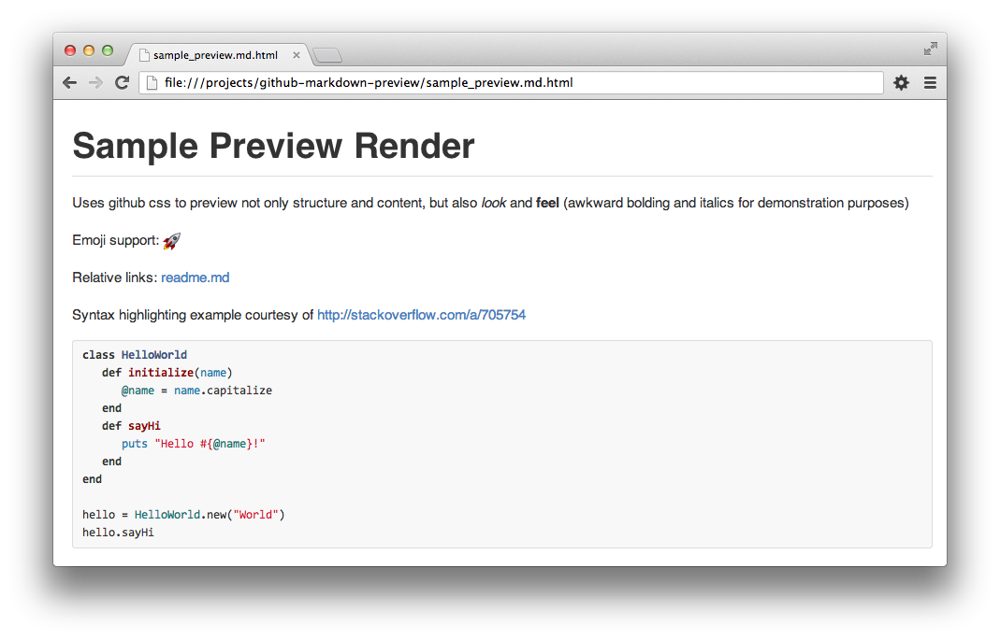

# Local Github Markdown Preview [](http://travis-ci.org/dmarcotte/github-markdown-preview)

Use your favorite editor plus the usual edit/refresh cycle to quickly write and polish your Github markdown files.

This program marries [html-pipeline](https://github.com/jch/html-pipeline) with the [Listen file watcher](https://github.com/guard/listen) to provide a high-fidelity preview of Github Flavored Markdown in your local browser which automatically updates on edit.



## Installing
```
gem install github-markdown-preview
```

## Usage
### Command line
```bash
# This will write the html preview along side your markdown file (<path/to/github-flavored/file.md.html>)
# Open in your favorite browser and enjoy!
github-markdown-preview <path/to/github-flavored/file.md>
```
* The `.html` preview is written beside your `.md` file so that you can validate [relative links](https://github.com/blog/1395-relative-links-in-markup-files) locally
* The `.html` preview is deleted when the script exits

### Code
```ruby
require 'github-markdown-preview'

# create a preview, which writes the source_file.md.html file to disk
preview = GithubMarkdownPreview::HtmlPreview.new('source_file.md')

# access the preview information
preview.source_file # returns 'source_file.md'
preview.preview_file # returns 'source_file.md.html'

# explicitly update the preview file from the source
preview.update

# watch the source file and update the preview on change
preview.watch # non-blocking watch
preview.watch! # blocking watch

# add a callback to be fired on update; add multiple listeners by calling again
preview.update { puts 'Preview updated!' }

# stop watching the file (only applies to non-blocking watch method)
preview.end_watch

# delete the preview file from disk
preview.delete

# alternatively, tell the preview to delete itself when your program exits
preview.delete_on_exit = true
```

## Developing
```bash
bundle # grab the dependencies
rake test # verify you're in good shape
```
If you get a `require` error, you may need to set `RUBYOPT` to tell Ruby to grab dependencies from `rubygems`
```bash
export RUBYOPT='rubygems' # you'll probably want to persist this wherever you manage your env variables
```
To run your development copy of the main script without installing it
```
bundle exec bin/github-markdown-preview
```
To install the your development copy to your system
```
rake install
```

## Contributing

[Contributions](contributing.md) welcome!