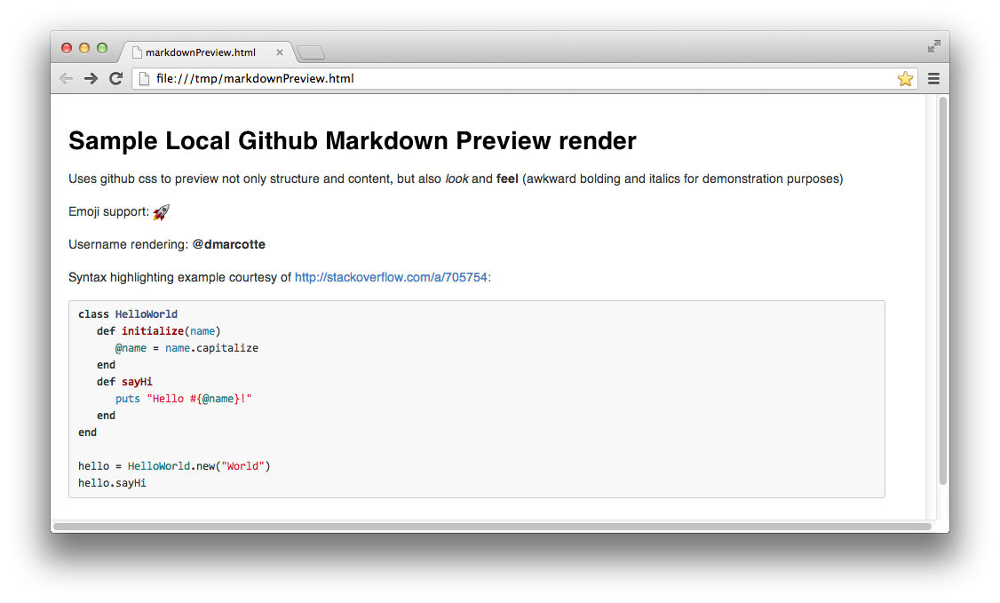

# Local Github Markdown Preview

Use your favorite editor plus the usual edit/refresh cycle to quickly write and polish your Github markdown files.

This simple script marries [html-pipeline](https://github.com/jch/html-pipeline) with the [Listen file watcher](https://github.com/guard/listen) to provide a high-fidelity preview of Github Flavored Markdown in your local browser which automatically updates on edit.



## Installing
* Grab the dependencies:

    ```bash
    gem install rb-inotify --version '~> 0.8.8'
    gem install html-pipeline listen github-linguist
    ```
* You might get an error when attempting to install the above extensions. Don't panic: just follow the helpful instructions (e.g., `icu required (brew install icu4c or apt-get install libicu-dev)`).
* Clone this repository, add the directory to your `PATH`
* `git fetch --tags` for updates
* `git checkout v1.3` to pin to the latest version

## Usage
```bash
# This will write the html preview along side your markdown file (<path/to/github-flavored/file.md.html>)
# Open in your favorite browser and enjoy!
github-markdown-preview.rb <path/to/github-flavored/file.md>
```
* The `.html` preview is written beside your `.md` file so that you can validate [relative links](https://github.com/blog/1395-relative-links-in-markup-files) locally
* The `.html` preview is deleted when the script exits
* I set up a "External Tool" in my IDE which launches `github-markdown-preview` for the active file.  Your favorite IDE/Text-editor should have a similar mechanism

## Contributing

If the script isn't working as promised, please [file an issue](https://github.com/dmarcotte/github-markdown-preview/issues)!

As for new features, in its current state, this script is meeting my needs so I probably won't be beefing it up much.  I acknowledge that it's pretty low-fi though, so if you've got desires to make it more slick, send a [pull](https://github.com/dmarcotte/github-markdown-preview/pulls)!
